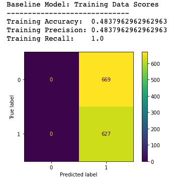
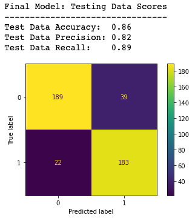
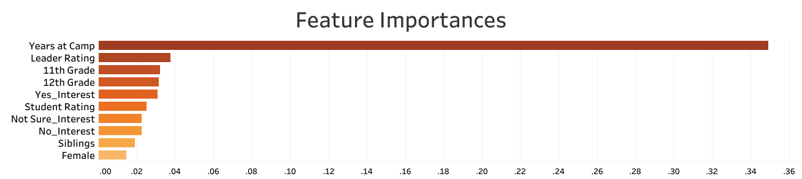

# SunStride_Business_Analysis

## Overview

SunStride is an adventure travel company for teens that sends students all over the world each summer season. SunStride needs a system for projecting how many students they can expect to return next summer so they can approriately allocate funds and pay their outfitters' non-refundable deposits, which are due almost a year in advance. I built the company a predictive model using a random forest classifier and it resulted in a model that is able to predict a student will return with a precision score of ~.82. Based on this result, SunStride is able to make a confident determination of how many students will return and how much money they may need to spend on marketing to fill in the rest of the spaces with new students. The model identified the feature "Years at camp" as the most impactful when the model was making splits. This indicates that if SunStride is able to retain a student for at least a second summer season then they are significantly more likely to continue seeing that student return for future summers. To retain students I recommend SunStride focus any marketing spend on finding new, young customers who have many years left to return and keeping these students as engaged as possible after they have signed up. 

## Business Problem

Because the company only operates its trips in the summer, its cash flow is cyclical annually with a major influx in August when enrollment opens and then it tapers off throughout the rest of the year. This inflow of cash is crucial, as it allows the company to hire and pay the outfitters that will run the next seasons' trips (many of whom require a majority of the payment up front and a year in advance to hold the spots!). SunStride needs a more robust system for projecting how many students they can expect to return the following summer so they can project how many spaces to hold (and pay for) for activities the next season. 

The final model I built SunStride uses random forest classification to sort students into two categories: returning (designated with a 1) or not (a 0). The model takes into account features like the student's grade, gender, and their overall rating of the trip they just finished (rated on a scale from 1-6), among many other features. Initially, the models I built were drastically overfitting to the training data - as many tree-like classifiers tend to do if left un-tuned. With proper tuning through grid-searching and additional model iterations, the final model achieved an accuracy score of .85, a precision score of .82 and a recall score of .88 when introduced to unseen testing data. 

For this analysis, I am focused on the precision score which represents the ratio of false positives predicted by the model. A false positive means the model is predicting that a student will return, when they do not actually re-enroll the next season. The lower the precision score (between 0 and 1.0) the higher the number of false positives predicted. If SunStride were to use a model that predicted many false positives then they may allocate funds incorrectly, as they are projecting a higher student return than the company will actually see. Of course there are also new students that come on board each season, but it requires less marketing spend and less effort in the onboarding process to retain an existing student than it does to onboard a new student. 

A false negative, on the other hand, which is tracked best through the recall score, represents our models ability to predict a student will not return when they actually do. This is not necessarily ideal either for SunStride, as it represents money left on the table or it may miss earning opportunities by not having space for these students, but ultimately it does not cause any immediate negative impact on the business if not enough spots are offered because no money is exchanging hands with outfitters in this case.

## Data Understanding

The data was provided by SunStride from their customer management system. This system houses all the demographic data fro each custemr along with the post-trip ratings and opinions that each student reported after travelling with the company. Specifically, we are analyzing is the 2022 summer's student data, because we are able to identify and track whether or not these students returned for the 2023 season. The target variable is the student's 2023 season's status, which was distilled down to represent whether the student returned (Enrolled) or did not (which could have been represented by a few other designations that all meant the student did not travel with SunStride again). 

## Data Preparation

The features included in the dataset are a mix of both categorical and numeric varibles. Significant pre-processing was needed to clean and prepare the data for final modeling. During this cleaning stage, many columns were dropped from the dataset for various reasons (such as too many unique values to impactful in a predictive model, etc), and all of these reasons are documented in the ['Data_Cleaning_Final'](Data_Cleaning_Final.ipynb) notebook linked here along with detailed descriptions of all the features that are included in the final model.

The remaining work in this project is documented in the modeling notebook titled ['Classifer_Models_Final'](Classifier_Models_Final.ipynb). Some additional pre-processing steps outlined in this notebook include the imputation of missing column values and the OneHotEncoding of the categorical freatures. The numeric features in this case were not scaled, because the final model does not take the measure of distance into account, therefore the varying scales of the numeric features does not negatively impact the model's performance.

Finally, before any modeling can begin, I split the data into training and testing sets. Performing this step now prevents data leakage by keeping the testing data hidden throughout the entire modeling process until a final model is chosen. 

### Baseline Understanding:
- First I will check the value counts in the taget column and normalize the output to see the ratio of students that returned to the overall dataset. 
- Then I will build a dummy model, which should result in scores that mirror the value I discovered in the normailzed value_counts of the 'target' column, becasue the dummy model will only pick the positive (1) value class. Of course this inital model will only act to represent a starting point for analysis, as it would not be useful to SunStride to have so many false positive predictions. 
- I expect to see the ~.48 value for the positive class (designating the model is predicting that a student will return) to be repeated in the scoring for the dummy model:
- This model's precision score represents the baseline that I will seek to improve through various modeling techniques and tuning. My goal moving forward will be to improve upon this ~.48 precision score. I plan to continue to include the other scores in my analysis, however my focus on optimizing the precision score will remain. See the confusion matix and futher explanations below:

#### Focus on Precision Score and Reducing False Positives:
The precision score represents the 'False Positives' generated by the model, this means the model is predicting that a student will re-enroll (designated with a 1 in the confusion matrix above) when they in fact do not re-enroll the following summer (designated by a 0 marker). 
- The precision score represents all of the students that were incorrectly predicted to re-enroll the next summer when they do not in fact choose to travel with SunStride again. This mistaken prediction could cause the SunStride HQ to allocate funds for this higher expected enrollment, over-budgeting and ultimately being left with unfilled trips.
- For many of the outfitters that SunStride works with, a flat rate is charged regardless of the trip capacity, thus causing SunStride to have to take a loss for these unfilled spots.
- The recall score, in this case, represents the model's generation of False Negatives. 
> - A False Negative in this case represents the instances where the model has designated a student will NOT re-enroll the next summer but they actually do.
> - Yes, this figure could represent money left on the table, defined as an opportunity for SunStride to fill a trip spot that the company has not allocated resources for; however, SunStride does not ultimately lose any money out of pocket in these instances and would be able to add the student to the Waitlist for the next summer, which can build anticipation for students and families for the next season.

### OneHotEncoder
- In order to use the categorical feature columns in the classifier models I will build, I need to first OneHotEncode out each of the columns' categorical variables. This means that I will be creating a matrix of all binary values that the classifier will be able to read and use to make splitting decisions.
- For example: the OneHotEncoder dealing with the 'Gender' column which contains either 'Male' or 'Female' will split this column into two new columns for each record in the dataset. If the student's gender is designated male before the split then the resulting 'Gender_Male' column generated by the encoder will contain a value of 1 and the 'Gender_Female' column for this same record will contain a 0 and so on. 

## Modeling Overview:
To model this data I first began by building a DecisionTree Classifier that used all default settings from sklearn and then for later iterations I used grid searching to identify the optimal hyperparameters for achieving the best precision score and tuned the model to these settings. For reference, the sklearn documentation for a DecisionTreeClassifier is provided here: [documentation](https://scikit-learn.org/stable/modules/generated/sklearn.tree.DecisionTreeClassifier.html#sklearn.tree.DecisionTreeClassifier.feature_importances_). My first model appeared to be overfit to the training data, as evidenced by all scores of 1.0, which were not matched when I ran cross validation scores:
> - After cross-validating, the first iteration of the DecisionTree model was definitely overfit, as evidenced by the lower scores for Accuracy, Precision, and Recall.
> - Overall a precision score of .81 is not bad, but it certainly leaves some room for improvement. I will further analyze the features contributing to this inital high score so I can later check if these features remain as significant throughout later model iteraions.

Next, I preformed a grid search next to identify the optimal hyperparameters for the DecisionTree model that would result in the best precision score.
> - I included all the default hyperparameter settings so the grid search will compare these options used in Model 1 as it iterates through making each of the new models with different hyperparameters tuned. 
> The two hyperparameters I'm focusing my grid search on:
>> - **'max_depth'**: this defines a hard stopping point for splits the decision tree is allowed to make. The default is None because, left unchecked a decision tree will just keep splitting until it creates pure leaf nodes. By setting a max_depth the tree is better able to generalize to new data because it does not have the free range to overfit to training data because we are setting a hard stop parameter.
>> - **'min_samples_leaf'**: this hyperparameter defines how many samples a leaf node can have at a minimum. The defualt is 1 because that is the purest form of a leaf node. By increasing the minimum sample per leaf, the tree is forced into another hard stop when it reaches the minimum specified. Similar to the max_depth parameter, this hyperparameter is used to reduce overfitting and it generates a model that generalizes better to unseen data, which is waht we are hoping for!

After the only marginal improvement from tuning the DecisionTree Classifier, I chose to model the data with a RandomForest ensemble classifier model. The RandomForest model uses many single decision trees, all pulling distinct and differnet samples from teh training data to perform classification on. RandomForest models tend to generalize to unseen data better as they use the combine the splitting power of many trees rather than relying on a single tree. The documentaion for the RandomForest Classifier is linked here: [documentation](https://scikit-learn.org/stable/modules/generated/sklearn.ensemble.RandomForestClassifier.html).

Similar to how I proceeded in modeling with the DecisionTree Classifier, I began modeling with the RandomForest by using all defualt settings established for the hyperparameters. The initla model again overfit to training data (as expected!) and then resulted in a cross-validated precision score of ~.82. This score, though equal to the tuned decision tree model's score, showed potential in moving forward in tuning the RandomForset model type as it's baseline begins at the same score we left off the decision tree. I next performed a grid search to optimize the hyperparatemers of the RandomForest Classifer to acheive the best precision score and ultimately was able to achieve a precision score of ~.83. 

See the improvement in the model's predictive ability by reviewing the confusion matrix below:

The tuned verision of the RandomForest model was then chosen for my final model and I introduced the unseen tesing data. The model performed almost identical on the testing data as it performed on the training data suggesting it is well fit to predict unseen data at the scoring levels seen on training data. Next I analyzed the feature importances that contributed the model's splitting decisions and generated the graph below:

This graph shows the significant impact of the 'Years at Camp' feature in making splitting decisions for the model. This level of signifance suggests that a student's status as an alumni or returning student greatly impacts their decision to return or re-enroll the following summer. 

## Conclusion:
### Recommendations
According to the feature importances analysis, it appears that the feature impacting the rate of re-enrollment the most is wther or not the student has already returned at least one other time to camp. I recommend that the company make additional efforts to add trips for the youngest age groups of campers as it appears there are only two trips that allow 6th grade students and 3 that allow 7th grade students to travel. An increased marketing push to get more kids on board younger increases the possibility that these students will be able to return multple years in a row.

SunStride could effectively use this model by deploying it at the end of every summer season as soon as all the student and leader ratings are recorded, as it appears that a high student and high leaders' ratings of students also had a significant impact on whether or not that student will return the following summer. I recommend that the company find a way to streamline the recording process for gathering these ratings, as I understand it now these are initally recorded on paper and then manually entered into the computer.

For my final recommendation, I suggest that the company offer additional benefits for returning students along the lines of discounted trip costs or promotions on the company's website and social media accounts (which all the students love to see!).

### Next Steps
The model doesn't currently project new students that are enrolling for the first time each season, and if I was to continue working on this project I would propose that one of the next steps would be to analyze new markets in the country to ensure that there is a consistent and steady flow of new customers being reached by the company. This analysis could unfold in many ways, but likely would develop through comparitive reasearch of the current successful markets and the identifiation of untapped markets with similar demographic characteristics.

Another potential next step would be to run this same analysis for multiple years of the company's data to see if an additional patterns coudl be picked up by the model. My final suggested next step would be to use this model to guide marketing spend decisions, such as targeting the younger students by adding more trip options and promoting their engagement with the brand to promote student further retention.

├── data
│   ├── Years_at_Camp.csv
│   ├── cleaned_student_enrolled_demographics.csv  
│   ├── features_table.csv
│   ├── student_enrolled_demographics.csv  
├── eda_notebooks
│   ├── eda0_data_cleanup.ipynb
├── images
│   ├── Dummy_Model_CM.png
│   ├── Feature_Importances_Final.png 
│   ├── Feature_Importances_less_YaC.png
│   ├── Final_Model_CM.png  
│   ├── Sunrise.jpeg  
│   ├── Years_at_Camp.png      
├── .gitignore
├── Classifier_Models_Final.ipynb
├── Data_Cleaning_Final.ipynb
├── LICENSE
├── Presentation.pdf
├── README.md
